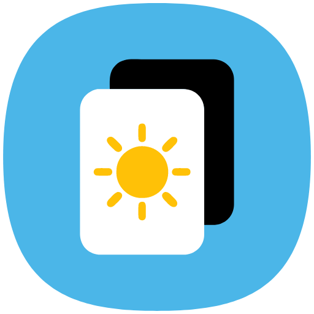
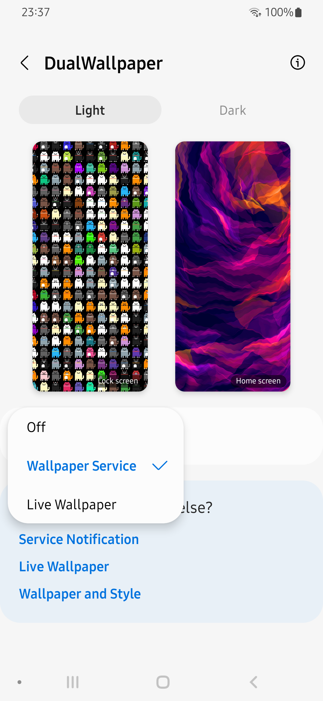
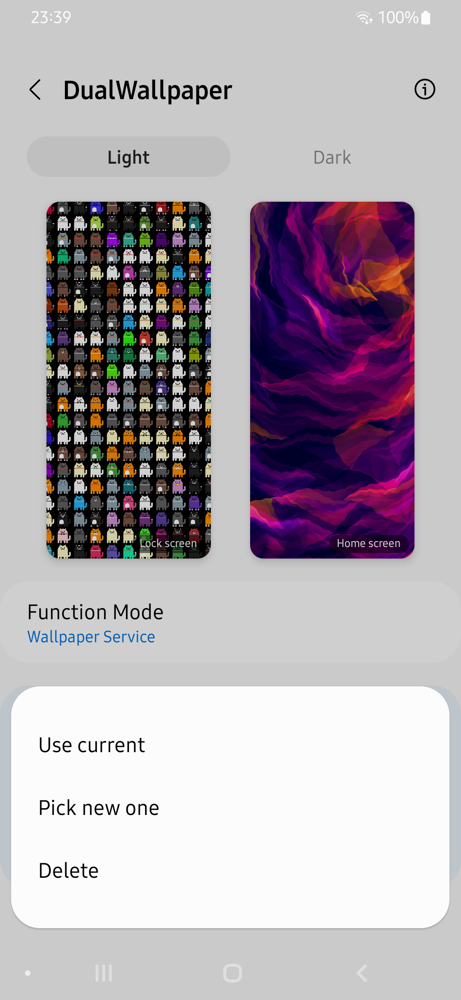
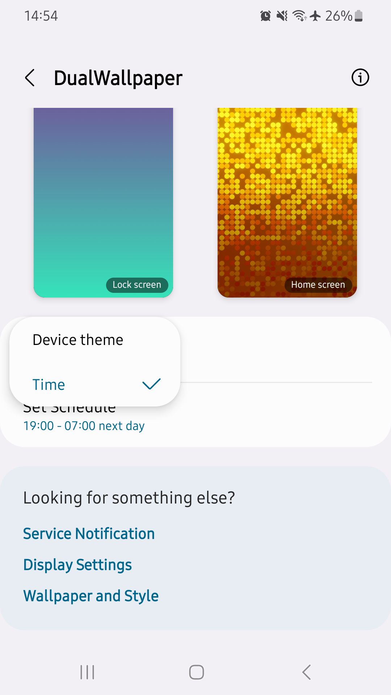
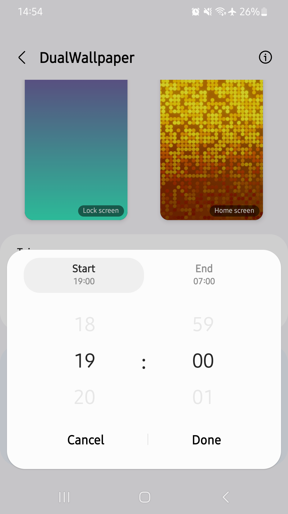

#  DualWallpaper

Customize your device even more by having two separate sets of wallpapers for light and dark mode. When your device's theme changes, this app will automatically change your wallpaper to the one you've selected. It is also possible to switch wallpapers based on the time.

You can chose an image, a plain color or a gradient for each wallpaper (light/dark and lockscreen/homescreen). Those will then be used as wallpapers when the device's theme changes or the choosen time is reached.

And all of this for free and without ads!

      

## Translations

You can help me out with translations [here](https://poeditor.com/join/project/is9K6CJAaL).