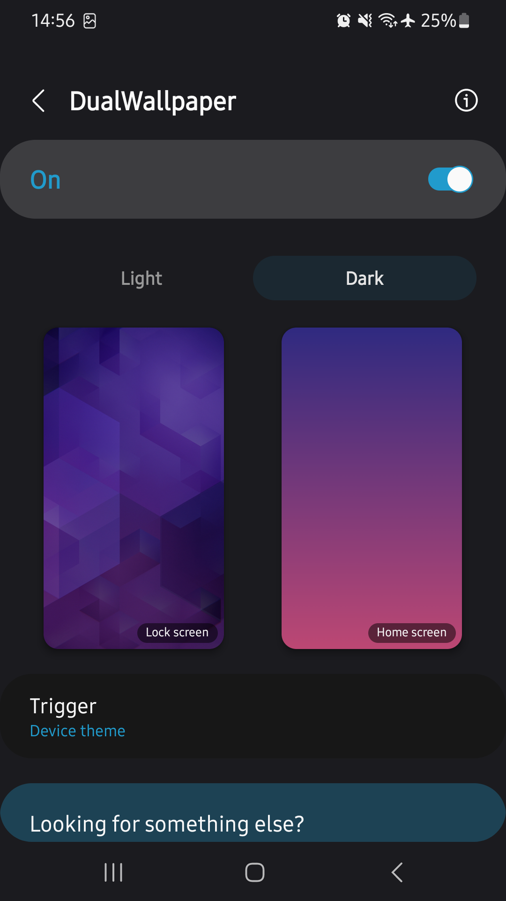
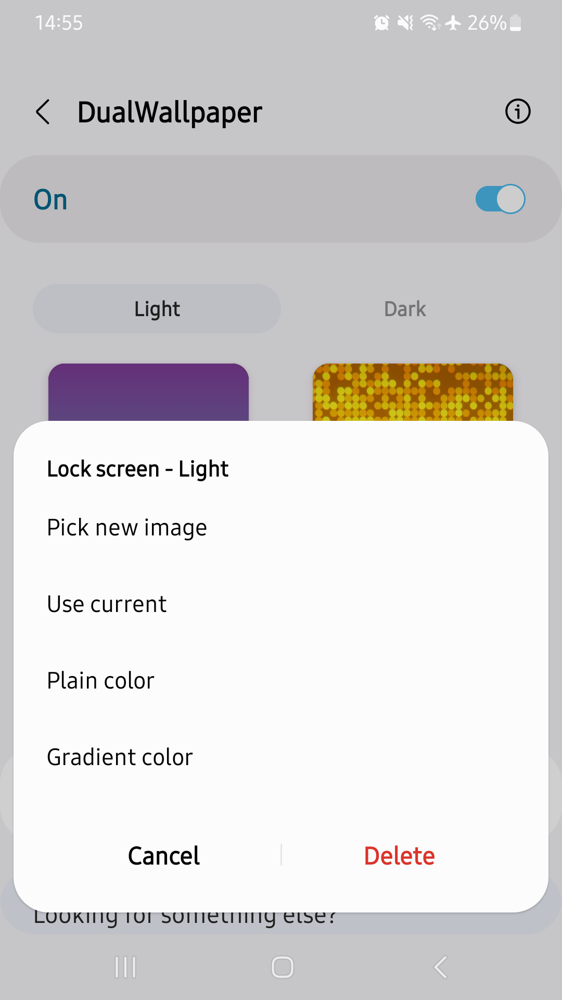
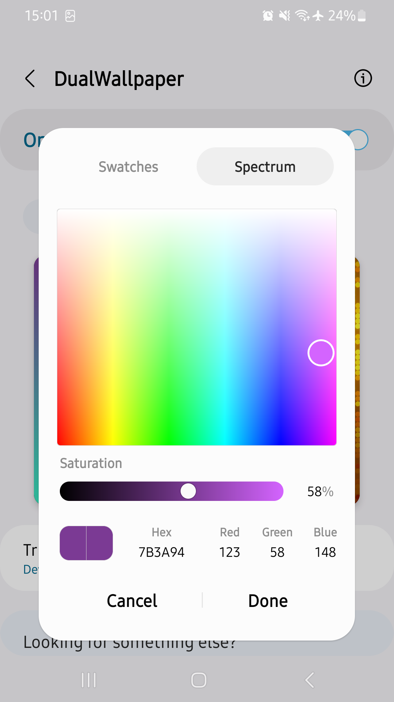

#  DualWallpaper

Customize your device even more by having two separate sets of wallpapers for light and dark mode. When your device's theme changes, this app will change your wallpaper to the one you've selected accordingly. To handle the change this app offers two possibilities: ``Wallpaper Service`` and ``Live Wallpaper``. In my opinion the first option is more reliable and works better but in some cases the app might get killed by the system and in this case I'd suggest using the second one. You have to see for yourself which option works best on your device.

   