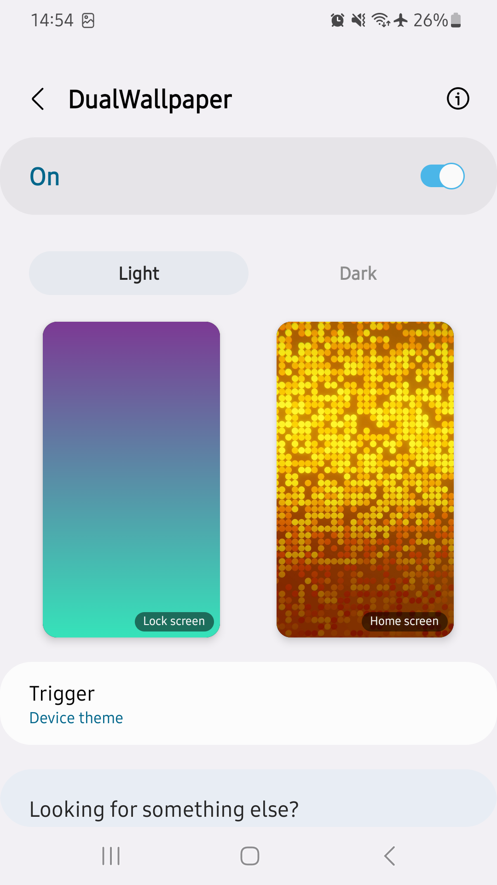
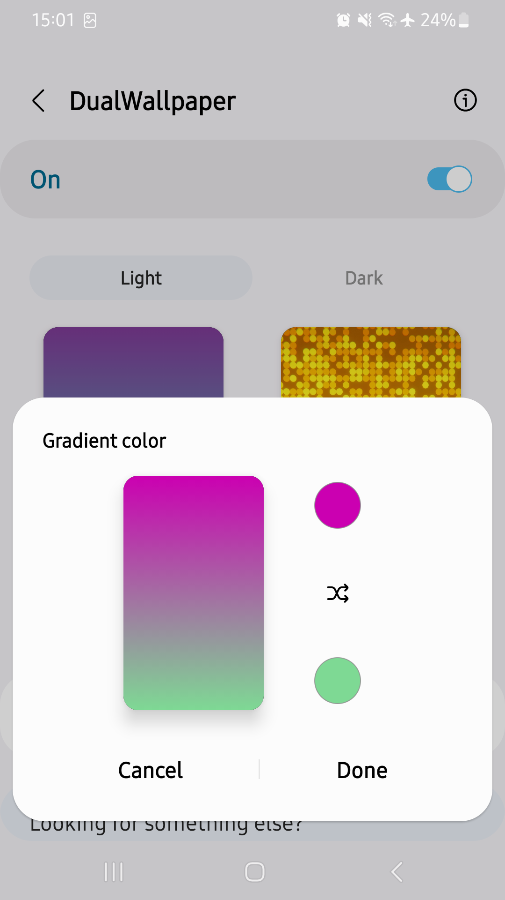

#  DualWallpaper

Customize your device even more by having two separate sets of wallpapers for light and dark mode. When your device's theme changes, this app will automatically change your wallpaper to the one you've selected. It is also possible to switch wallpapers based on the time.

      

## Translations

You can help me out with translations [here](https://poeditor.com/join/project/is9K6CJAaL).

